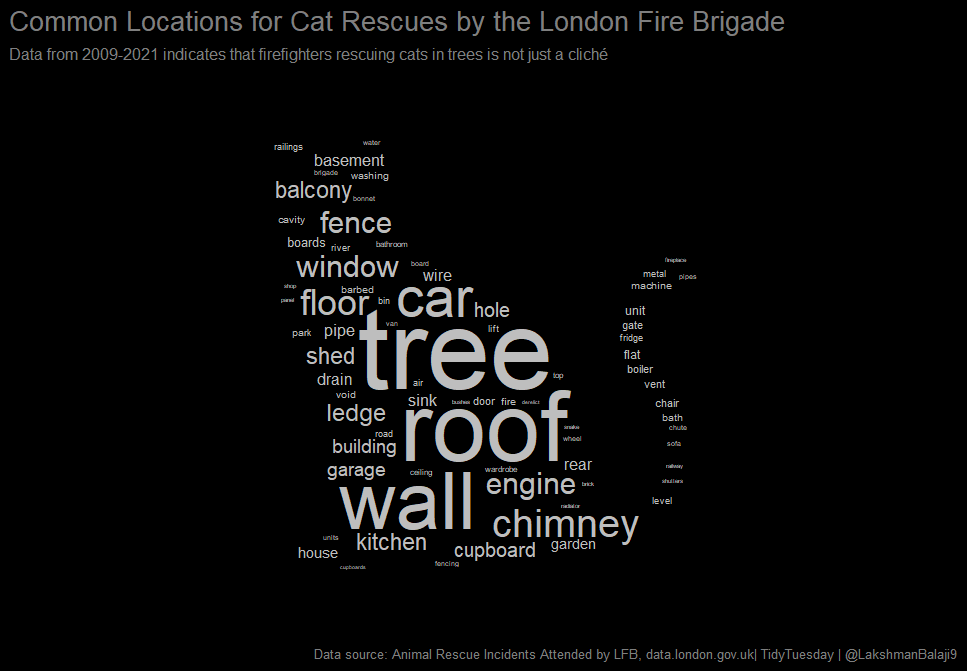

Animal Rescues
================
Lakshman Balaji
6/30/2021

# Background

-   We are going to use a *tidytuesday* dataset dealing with Animal
    Rescues sourced from [*The London Fire Brigade (LFB) / London
    Government*](https://data.london.gov.uk/dataset/animal-rescue-incidents-attended-by-lfb).

-   This data contains information from 2009-2021 on the various animal
    rescue incidents attended to by the LFB.

-   Each row represents an incident. There are a number of interesting
    variables, such as the time that the call was placed to LFB, the
    type of animal, the number of trucks dispatched to attend to the
    incident, costs, area in the city, and so on.

-   For more information about the dataset, check out the official
    TidyTuesday page
    [here](https://github.com/rfordatascience/tidytuesday%5D) and
    navigate to the datasets section &gt; year 2021 &gt; week 27, here
    is the specific link for instructions to access this
    [dataset](https://github.com/rfordatascience/tidytuesday/blob/master/data/2021/2021-06-29/readme.md).

-   A particular variable that interests me is the `final_description`
    variable that contains free text about the nature of the issue. This
    variable contains phrases like, ‘DOG IN THE RIVER’, ‘GOOSE TRAPPED
    IN FISHING WIRE’, ‘CAT STUCK IN FENCE’ etc.

-   Since I have never ceased to be amazed by the number of situations
    into which cats get themselves, *I am going to tokenize the free
    text using the tidytext() package and examine all of the
    locations/situations which are mentioned in the rescue calls to the
    LFB from 2009 to 2021 involving cats*.

-   My motivation for doing this is this particular
    [tweet](https://twitter.com/alyssastweeting/status/1409720487639273477/photo/1)
    by @[alyssastweeting](https://twitter.com/alyssastweeting), where
    she displays a chart of the five common locations in which cats get
    stuck, by time of day.

### Libraries and data import

Load libaries

``` r
# access tidytuesday data
library(tidytuesdayR)

# tokenize text
library(tidytext)
# https://www.tidytextmining.com/

# Add an image mask to ggplot
library(png)
# print image
library(knitr)

# for visualization
library(ggwordcloud)

# select packages from tidyverse
library(dplyr)
library(stringr)
library(forcats)
```

# Process data

Load cats data and peek at 10 random rows from the `final_description`
variable. This is week 27, 2021 data.

``` r
cats <- tidytuesdayR::tt_load(2021, week = 27)$animal_rescues %>%
          filter(animal_group_parent == "Cat")
# alternative
# library(openxlsx)
# cats<- read.xlsx("1cats.xlsx")
```

``` r
set.seed(987)
cats %>%
filter(row_number() %in% sample(1:nrow(cats), size = 10, replace = FALSE)) %>%
select(final_description) 
```

    ## # A tibble: 10 x 1
    ##    final_description                                  
    ##    <chr>                                              
    ##  1 KITTEN TRAPPED UNDER CUPBOARD                      
    ##  2 CAT STUCK IN HOLLOW ON ROOF                        
    ##  3 RUNNING CALL TO CAT STUCK IN TREE                  
    ##  4 KITTEN STUCK IN CAGE                               
    ##  5 CAT LOCKED IN BASEMENT                             
    ##  6 CAT TRAPPED IN GAP BETWEEN ROOF AND TILES          
    ##  7 Redacted                                           
    ##  8 CAT TRAPPED IN ENGINE BLOCK OF CAR  - FRU REQUESTED
    ##  9 Redacted                                           
    ## 10 CAT IN PRECARIOUS POSITION ON ROOF

Notice, we want to take rows like these and extract the useful
location/situation elements, which would be things like:

-   Cupboard
-   Roof
-   Hollow
-   Cage
-   Basement
-   Tiles
-   Engine
-   Car
-   Roof

We are not interested in words like:

-   in

-   of

-   on

-   cat

-   kitten

-   requested

-   precarious

-   To obtain the words from sentences, we apply the `unnest_tokens()`
    function. (Note: Link to a great book introducing text mining by
    David Robinson and Julia Silge is
    [here.](https://www.tidytextmining.com/))

-   While the `tidytext` package has a dataset called `stop_words` that
    removes basic stop words like *in*, *of*, and *for*, we will need to
    manually specify that we want words like *cat*, *kitten*, and
    *requested* removed because these do not give us any information
    about the location of the incident. I did this by quickly combing
    through the data visually and identifying the most frequently
    occurring extra stop words in the \~100 most frequently occuring
    words. I stored these as a vector.

-   Words like *precarious*, or *trapped* are interesting, but I will
    still remove them as they do not tell you anything about the
    location.

``` r
# unnest tokens
cat_locations <- cats %>%
                 select(final_description) %>%
                 unnest_tokens(word, final_description) 


# list of extra stop words to remove (note: iterative process
# use in conjuction with a the chunk of code lower down that 
# creates sortedwords to identify words to remove)
remove <- c("cat", "rspca", 
            "rscpa", "redacted",
            "assist", "kitten",
            "kittens", "animal",
            "call", "called", 
            "caller", "possibly", 
            "requested", "access", 
            "assistance", "attendance", 
            "attend", "officer", "inspector", 
            "owner", "meet", "leg", "paw", 
            "head", "eye", "request", "scene", 
            "rescue", "fru", "direct", "believed", 
            "days", "neighbors", "police" ,"reach",
            "camera", "fourth")


# list of words to tag as not having to do with location (note:
# iterative process, use in conjunction with the next chunk of code that 
# creates sortedwords to identify words to remove)
description <- c("trapped", "stuck", "injured", "fallen", "running", "inside", 
                 "locked", "unable", "precarious", "position", "distress", 
                 "underneath", "caught", "impaled", "inbetween", "wedged", 
                 "attacked", "broken")   


# processing
sortedwords <- 
                cat_locations %>% 
                # remove basic stop words
                anti_join(stop_words) %>% 
                # count number of times each word occurs. Useful to
                # run this section incrementally and in combination
                # with the previous block of code to identify all
                # extra stop words that need to be removed.
                count(word, sort = TRUE) %>%
                # make dataframe
                as.data.frame() %>%
                # consistent spellings for wall and distress
                mutate(word = case_when(word %in% c("walls", "wall")  ~ "wall",
                       word %in% c("distress", "distressed")       ~ "distress",
                                                        TRUE       ~ word )) %>%
                # remove words that occur in the remove vector
                filter(!(word %in% remove)) %>%   
                # calculate percent contribution
                mutate(pctcontrib = (100*n)/sum(n)) %>%   
                # arrange by word pct contribution
                arrange(-pctcontrib) %>%
                # keep top 100 words
                filter(row_number() <= 100) %>%
               # if word describes cat's situation, tag with 2
               #  if word describes cat's location, tag with 1
               # Note: run this incrementally, and as and when you
               # find words that don't have anything to do with location
               # modify the description vector above and rerun.
               mutate(type = case_when(word %in% description ~ 2,
                                                        TRUE ~ 1)) %>%
               # keep only the location words
               filter(type == 1) %>%
               # only two columns of interest
               select(word, n) %>%
               # rename
               rename(freq = n)
```

Take a look at the first 15 rows of the data now.

``` r
sortedwords %>% head(n = 15)
```

    ##           word freq
    ## 1         tree  507
    ## 2         roof  404
    ## 3         wall  199
    ## 4          car  166
    ## 5      chimney  143
    ## 6         wall  115
    ## 7        floor  106
    ## 8       window  100
    ## 9       engine   97
    ## 10       fence   89
    ## 11     balcony   68
    ## 12     kitchen   66
    ## 13       ledge   66
    ## 14    cupboard   62
    ## 15 floorboards   59

Notice that the word *wall* repeats twice. I fix this using base R.

``` r
repeatpos <- which(sortedwords$word == "wall") 
# repeated in rows 3 and 6

freqs <- sortedwords$freq[which(sortedwords$word == "wall")] 
# associated frequencies in rows 3 and 6: 199 and 115

# Assign sum of both frequencies to the first occurrence's freq
firstrow <- min(repeatpos)
sortedwords$freq[firstrow] <- sum(freqs) 
# assigns 199+155= 314 to the freq of the first occurrence of word 'wall'
# Drop subsequent rows, drops all subsequent occurrences of the word 'wall'
subsequentrows <- repeatpos[repeatpos > firstrow]
sortedwords <- sortedwords %>% filter(!(row_number() %in% subsequentrows))

# Calculate percent contribution and arrange
sortedwords <- sortedwords %>% 
               mutate(pctcontrib = (100*freq)/sum(freq)) %>%   
               # arrange by word pct contribution
               arrange(-pctcontrib)


# remove clutter
rm(firstrow, freqs, repeatpos, subsequentrows)
```

# Create figure

-   We will use the `geom_text_wordcloud_area()` function from the
    `ggwordcloud` package.

``` r
# set seed
set.seed(42)


#save in p
p <- 
  
  ggplot(sortedwords, aes(label = word, size = freq)) +
   
  # wordcloud
  geom_text_wordcloud_area(mask = png::readPNG("0cat.png"),
                           rm_outside = TRUE,
                           color = "grey") +
  
  # make size of words smaller if some important words don't fit.                
  scale_size_area(max_size = 22) + 
    
    
  theme_minimal() +
    
  labs(title = "Common Locations for Cat Rescues by the London Fire Brigade",
       subtitle = "Data from 2009-2021 indicates that firefighters rescuing cats in trees is not just a cliché",
       caption = "Data source: Animal Rescue Incidents Attended by LFB, data.london.gov.uk| TidyTuesday | @LakshmanBalaji9") +
    
    
  theme(plot.background = element_rect(fill= "black"),
        plot.title = element_text(color = "grey50", family = "Palatino Linotype", size = 15),
        plot.subtitle = element_text(color = "grey50", family = "Palatino Linotype", size = 9),
        plot.caption = element_text(color = "grey50", family = "Platino Linotype", size = 7))

# print p in console
p


ggsave("4_img1.png",
       p, 
      width = 7.386, height = 5.126, # try not to fiddle with width and height too much as you may lose the cat shape.
      dpi = 130.98,                  # if you want to, try playing with dpi here and the scale_size_area() argument to tweak appearance
      units = "in")
```

This is the image I saved:

``` r

```

<div class="figure">


<p class="caption">
Trees, roofs, walls, cars and chimneys are where cats get stuck most
often
</p>

</div>

*Note, the image as it appears in R, and the saved image may be
different*

Notes on sizing/saving this plot programmatically (trial and error) -
here’s what worked for me.

-   When your plot appears in the pop-up window in R, it appears
    properly sized.

-   But when you try to save it using `ggsave()`, you need to specify
    exact dimensions to make sure wordcloud doesn’t get messed up (may
    not get the shape of a cat)

-   Print the plot object in console, and it will appear in the plots
    pane.

-   Resize the plots pane till you are happy with how the image appears,
    then hit export, save as image

-   Choose png

-   note pixel dimensions that appear, these are your pane dimensions.
    Remember these, because your wordcloud needs these panel dimensions
    to appear coherent.

-   Note: for me, the pane dimensions were: width 709 pixels, height 492
    pixels

-   Now, in the `ggsave()` command, you should enter pane dimensions in
    the `height` and `width` arguments.

-   Ideally you should set dimensions to width: 709 pixels, height: 492
    pixels but `ggsave()` doesn’t allow the `units` argument to take
    pixels as a unit.

-   So you need to provide `height` and `width`in inches.

-   I used this [link](https://pixelcalculator.com/en) to calculate the
    size of my image in inches for a dpi of 120 initially (changed to
    130 dpi later)

-   Play around with these 2 parameters till you find an image that
    works for you.

-   the max size from the `scale_size_area()` layer in the plot. Set
    this to smaller if you notice some words are disappearing.

-   the resolution from the `ggsave()` command.
