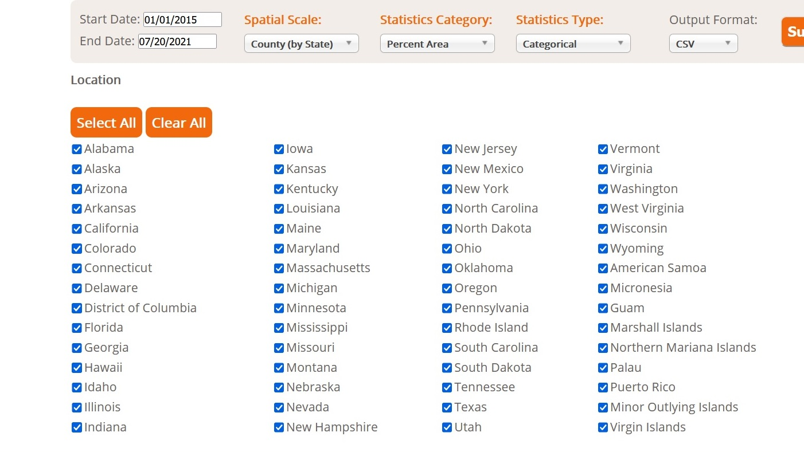

US Droughts
================
Lakshman Balaji
7/20/2021

# Background - the US Droughts dataset

-   This week’s *tidytuesday* plot was prompted by [this post by the NY
    Times.](https://www.nytimes.com/interactive/2021/06/11/climate/california-western-drought-map.html)
-   The TidyTuesday Github page has a dataset of droughts at the state
    level: to use that data, go
    [here](https://github.com/rfordatascience/tidytuesday) and navigate
    to the datasets section &gt; year 2021 &gt; week 30. Here is the
    specific link to this week’s
    [dataset.](https://github.com/rfordatascience/tidytuesday/blob/master/data/2021/2021-07-20/readme.md.)
-   However, I was more interested in the datasets provided by the
    source, [the US Drought
    Monitor](https://droughtmonitor.unl.edu/DmData/DataDownload/ComprehensiveStatistics.aspx).
-   I downloaded, for every week in the last 5 years, a county-level
    dataset of the percent area in each county considered to be
    drought-free, and if experiencing drought (which can be classified
    into one of
    [five](https://droughtmonitor.unl.edu/About/WhatistheUSDM.aspx)
    levels), the percent area that falls into each drought level. Note:
    I prefered to set the *Statistics Type* to ‘Categorical’ as opposed
    to cumulative. If you just want to replicate this analysis though,
    you don’t need to download the data. Just use the .csv that I have
    included in this repo.
    <div class="figure">

    
    <p class="caption">
    Settings I used for the data pull
    </p>

    </div>
-   My original idea was to sum the percent of land in each county that
    falls into the **‘severe (D2)’, ‘extreme (D3)’, or ‘exceptional
    (D4)’** categories and report that number on a map of the US as a
    single number — *the percent of land experiencing SEE (severe,
    extreme, exceptional) drought* for every week in the last five years
    (using an animation), but I later cut down this scope to just the
    last two years (\_June 16th 2019 - July 20th 2021) because the
    script was taking too long to run on my laptop.

## Libraries

Let’s get our libraries loaded.

``` r
# basic libraries
library(tidyverse)
library(lubridate)
library(urbnmapr)  # to get county and state boundaries
library(viridis)
library(kableExtra)


# for animation
library(gganimate)
library(gifski)
# library(devtools) install_github('thomasp85/transformr')
library(transformr)
library(Rcpp)
```

# Import data

Read in the .csv from the repo.

``` r
dat1 <- read.csv("1_dm_export_20150101_20210720.csv")
```

# Minor cleaning

-   Remove Alaska and Hawaii
-   Add week and year columns

``` r
# see list of unique states represented in the data pull
# table(unique(dat1$State)) remove non contiguous US:
# Alaska and Hawaii need to go
dat1 <- dat1 %>%
    filter(!(State %in% c("AK", "HI")))
# should have 50 states now length(unique(dat1$State)) # 50
# states represented in 1.08 million records


# Add week and year columns
dat1 <- dat1 %>%
    mutate(week = lubridate::week(as.Date(ValidStart)), year = lubridate::year(as.Date(ValidStart)), 
        wkyr = paste0(week, "-", year))
```

-   Filter to just the last 2 years’ worth of data.

``` r
dat1 <- dat1 %>%
    filter(as.Date(ValidStart) >= as.Date("2019-07-16"))  # I wrote this script in July 2021 so chose July 2019 as cut-off
# Should have just 334,530 obs
```

-   Add a variable that sums the percent of land area in each country in
    D2, D2 and D4 drought (hereafter referred to as **SEE drought** for
    severe, extreme and exceptional drought.)
-   Change the variable that contains the FIPS code (the `FIPS`
    variable) to match the name and type of the FIPS variable county
    data that we will import later from `urbnmapr`.

``` r
# sum of area in d2, d3, and d4
dat1 <- dat1 %>%
    rowwise() %>%
    mutate(drought.see = sum(c_across(D2:D4))) %>%
    ungroup()  # use ungroup() to exit rowwise() once you are done computing operations by row


# To match the urbnmapr county data (to be imported in the
# next step) Make sure that: FIPS is renamed to county_fips
# Make sure FIPS has five digits (pad with 0 in the front)
dat1 <- dat1 %>%
    rename(county_fips = FIPS) %>%
    mutate(county_fips = as.character(county_fips)) %>%
    mutate(county_fips = str_pad(county_fips, 5, "left", "0"))
```

-   Look at a sample of the data.

<table class=" lightable-classic" style="font-family: Cambria; width: auto !important; margin-left: auto; margin-right: auto;">
<caption>
Sample of data prior to joining county boundaries
</caption>
<thead>
<tr>
<th style="text-align:left;">
county\_fips
</th>
<th style="text-align:left;">
County
</th>
<th style="text-align:left;">
State
</th>
<th style="text-align:left;">
ValidStart
</th>
<th style="text-align:right;">
D2
</th>
<th style="text-align:right;">
D3
</th>
<th style="text-align:right;">
D4
</th>
<th style="text-align:right;">
drought.see
</th>
</tr>
</thead>
<tbody>
<tr>
<td style="text-align:left;">
01001
</td>
<td style="text-align:left;">
Autauga County
</td>
<td style="text-align:left;">
AL
</td>
<td style="text-align:left;">
2021-07-13
</td>
<td style="text-align:right;">
0
</td>
<td style="text-align:right;">
0
</td>
<td style="text-align:right;">
0
</td>
<td style="text-align:right;">
0
</td>
</tr>
<tr>
<td style="text-align:left;">
01001
</td>
<td style="text-align:left;">
Autauga County
</td>
<td style="text-align:left;">
AL
</td>
<td style="text-align:left;">
2021-07-06
</td>
<td style="text-align:right;">
0
</td>
<td style="text-align:right;">
0
</td>
<td style="text-align:right;">
0
</td>
<td style="text-align:right;">
0
</td>
</tr>
<tr>
<td style="text-align:left;">
01001
</td>
<td style="text-align:left;">
Autauga County
</td>
<td style="text-align:left;">
AL
</td>
<td style="text-align:left;">
2021-06-29
</td>
<td style="text-align:right;">
0
</td>
<td style="text-align:right;">
0
</td>
<td style="text-align:right;">
0
</td>
<td style="text-align:right;">
0
</td>
</tr>
<tr>
<td style="text-align:left;">
01001
</td>
<td style="text-align:left;">
Autauga County
</td>
<td style="text-align:left;">
AL
</td>
<td style="text-align:left;">
2021-06-22
</td>
<td style="text-align:right;">
0
</td>
<td style="text-align:right;">
0
</td>
<td style="text-align:right;">
0
</td>
<td style="text-align:right;">
0
</td>
</tr>
<tr>
<td style="text-align:left;">
01001
</td>
<td style="text-align:left;">
Autauga County
</td>
<td style="text-align:left;">
AL
</td>
<td style="text-align:left;">
2021-06-15
</td>
<td style="text-align:right;">
0
</td>
<td style="text-align:right;">
0
</td>
<td style="text-align:right;">
0
</td>
<td style="text-align:right;">
0
</td>
</tr>
<tr>
<td style="text-align:left;">
01001
</td>
<td style="text-align:left;">
Autauga County
</td>
<td style="text-align:left;">
AL
</td>
<td style="text-align:left;">
2021-06-08
</td>
<td style="text-align:right;">
0
</td>
<td style="text-align:right;">
0
</td>
<td style="text-align:right;">
0
</td>
<td style="text-align:right;">
0
</td>
</tr>
</tbody>
</table>

-   In the above example, in the first row, for instance, Autauga
    County, in the week starting on 2021-07-13 (13th July 2021) had 0
    percent of its land area classified as D2, 0 percent in D3 and 0
    percent in D4. So the `drought.see` variable is 0, indicating that
    in this week, no part of Autauga Country was experiencing any
    severe, extreme or exceptional drought.

# Add county data and states data

-   Note: we use the `urbnmapr::` package to add county data. Also load
    in state data. This chunk could take a long time to run so I
    recommend increasing memory prior to executing the code.

``` r
# my current memory size
memory.size()
```

    ## [1] 360.18

``` r
# check my limit
memory.limit()
```

    ## [1] 16137

``` r
# change memory.limit()
memory.limit(size = 56000)
```

    ## [1] 56000

``` r
# join county data
dat1.counties <- left_join(dat1, urbnmapr::counties, by = "county_fips")
# notice this dataset is huge because for every row in the
# dat1 dataset, we join something like 50-60 elements
# (lines) representing the polygon outlines.

# create a states map
states.map <- urbnmapr::states %>%
    filter(!(state_name %in% c("Alaska", "Hawaii")))
```

# Plot animation

-   Now, we go ahead and plot the animation. This chunk could take up to
    15 minutes to run but the animation at the end is worth it.

``` r
anim <-   ggplot(data = dat1.counties) +
          
        
          # County map
          geom_polygon(data = dat1.counties,
                       mapping = aes(x = long, y = lat,
                                     group = group,
                                     fill = drought.see)) +

          # Add state outlines
          geom_polygon(data = states.map,
                       mapping = aes(long, lat,group = group),
                       fill = NA, color = "#ffffff", size = 0.4) +
  
          # color scale
          scale_fill_viridis(option = "B",
                             name = "Percent of land area experiencing SEE drought") +
  
          # coordinates
          coord_map(projection = "mercator") +

          # theme
          theme_minimal() +
  
         # other themes
          theme(
          legend.position = "bottom",
          legend.text.align = 0,
          plot.margin = unit(c(.5,.5,.2,.5), "cm")
          ) +
  
          theme(
          axis.line = element_blank(),
          axis.text.x = element_blank(),
          axis.text.y = element_blank(),
          axis.ticks = element_blank(),
          axis.title.x = element_blank(),
          axis.title.y = element_blank(),
          panel.grid.major = element_blank(),
          panel.grid.minor = element_blank(),
          ) +
  
         theme(
         plot.title=element_text(face = "bold")
          ) +
  
          # transition: used the transition manual verb.
          transition_manual(frames = as.Date(ValidStart)) +
  

         # title
         labs(title = "Drought in US Counties",
              subtitle = paste0("Map shows percent of county land area experiencing \nsevere, extreme or exceptional (SEE) drought in the week of ",                                 "{current_frame}"),
              caption = "Data source: US Drought Monitor | TidyTuesdays | @LakshmanBalaji9")


# Save animation
# animate(anim, renderer = gifski_renderer("3_usdroughts.gif"))
```
